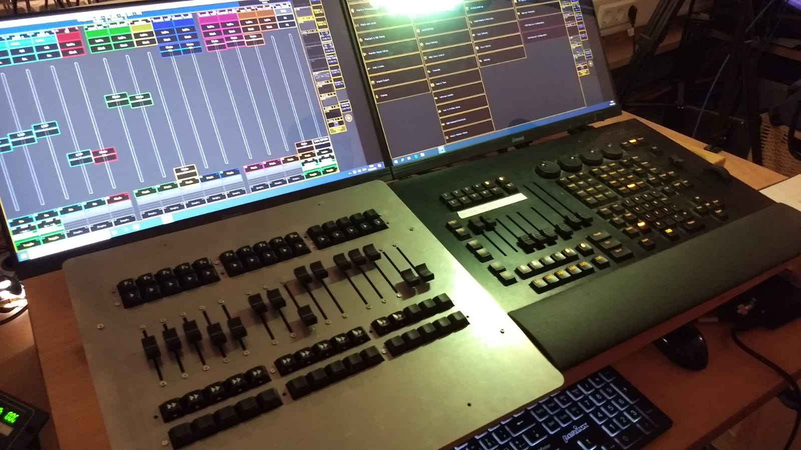
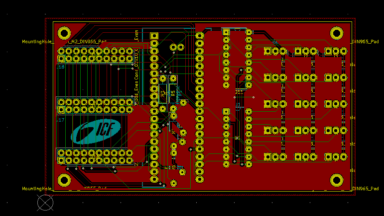
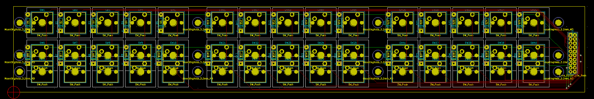
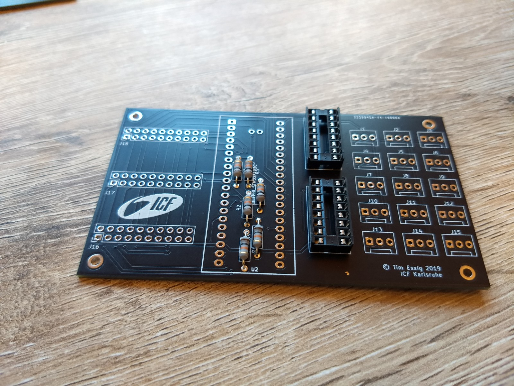
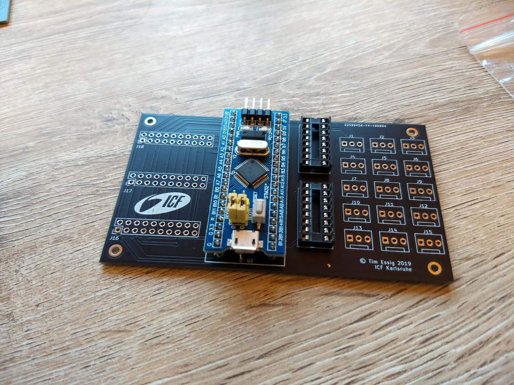
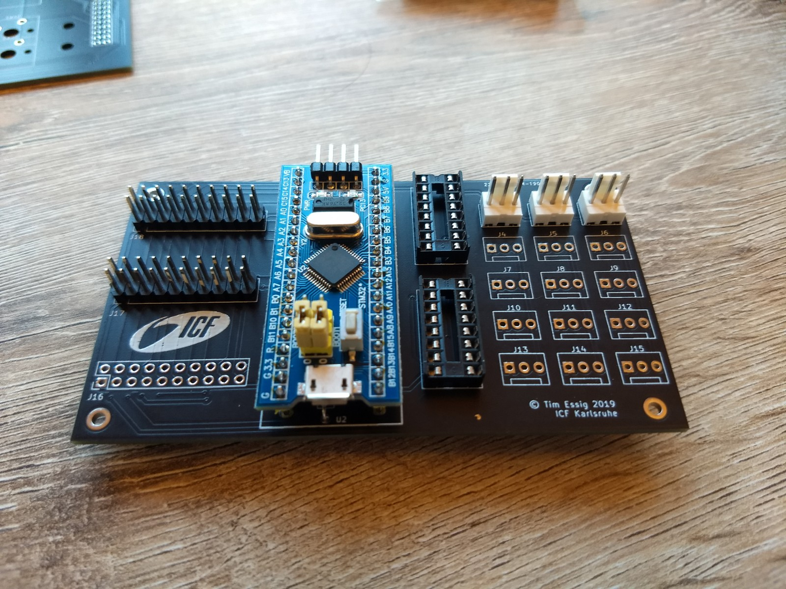
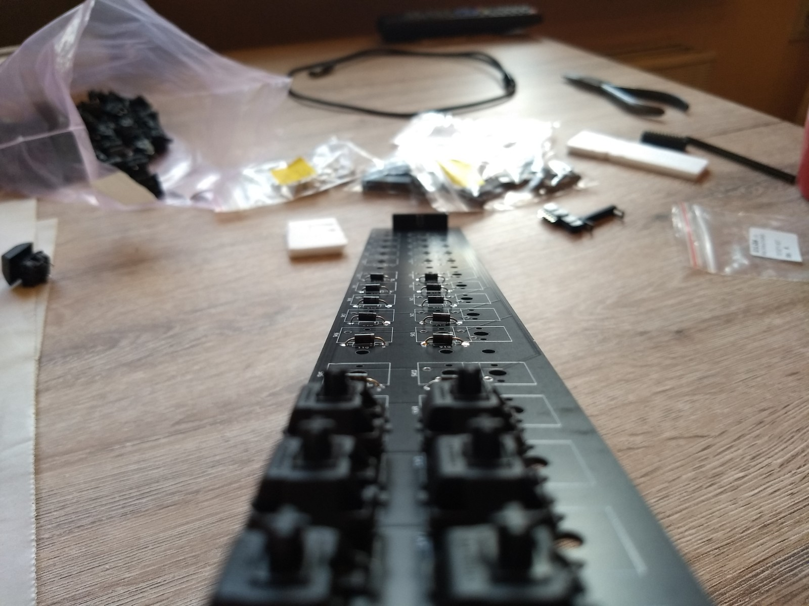
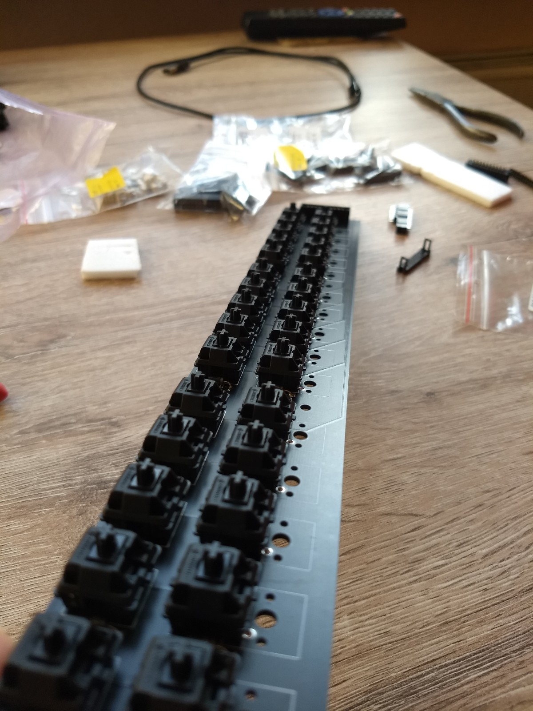
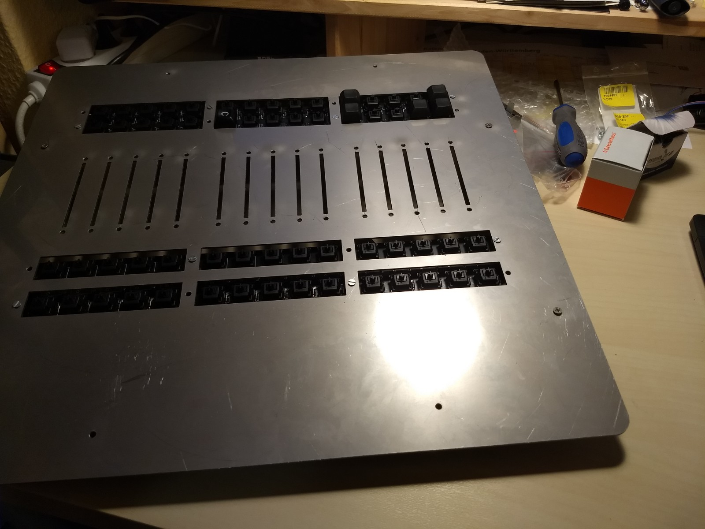

# SpareFaders

A (still work in progress) STM32-BluePill based MA-Style midi controller featuring 60 buttons and 15 faders.

## PCB

The project is made up of two PCB types. A controller PCB and a keys PCB with can be assambled both for the keys above or under the faders.

### Assembly

## Front Plate

The files for the front plate will be uploaded soon.

